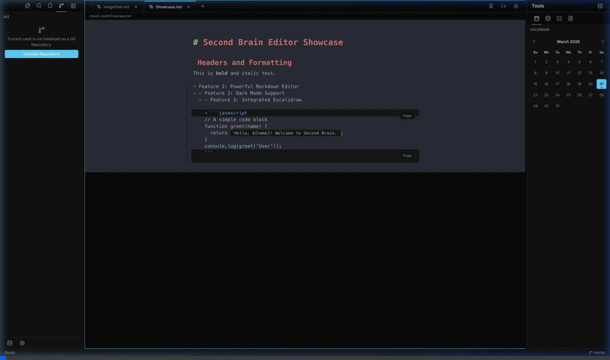
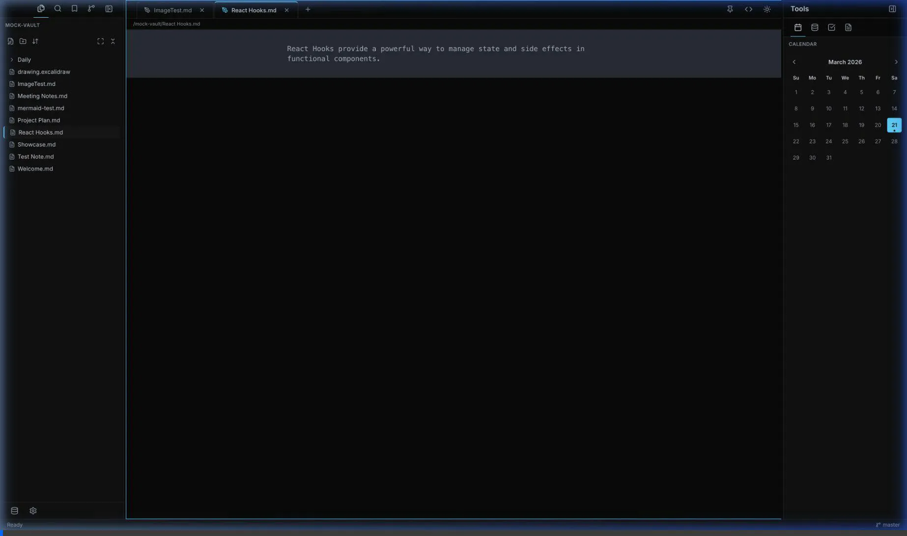

<h1 align="center">Syntagma: Second Brain Editor</h1>

  A powerful, customizable, and open-source personal knowledge management tool built for speed and flexibility.

## Overview

**Syntagma** is a beautifully designed, dark-mode native Second Brain Editor that empowers you to capture, connect, and explore your thoughts seamlessly. It's built with modern web technologies to be fast, responsive, and completely open-source.

**Feel free to fork, modify, and make it your own!** Syntagma is completely free and open-source.

## ✨ Features Highlight

Experience the power of Syntagma with these integrated features:

### 📝 Rich Text Editing & Markdown
Write seamlessly with full Markdown support, live preview, formatting shortcuts, lists, code blocks, and more—all available natively.

### 📅 Daily Notes
Capture your thoughts on the fly. The built-in calendar lets you instantly jump to today's note to manage your daily tasks, logs, and journaling.

### 🎨 Integrated Image Editor
Paste an image straight into your notes and edit it without leaving the app! You can quickly draw, annotate, and transform images right within your workspace.

### 📋 Note Templates
Never start from a blank page again. Use customizable templates to instantly scaffold new notes for meetings, daily reviews, or project planning.

### 🔍 Fast Fuzzy Search
Find anything in your vault instantly. The lightning-fast fuzzy search feature ensures you can jump directly to any document without friction.

### 💾 Git Backup & Version Control
Never lose your data. With built-in Git integration, you can automatically backup your vault, track file history, and manage your versions directly from the UI.

### 🧩 Plugin System (Excalidraw Integration)
Expand your editor's functionality. The deeply integrated plugin system allows tools like Excalidraw to run natively in your workspace, enabling rich diagrams, flowcharts, and visual notes.

## 🚀 Getting Started

To get started with Syntagma locally:

1. Clone the repository: `git clone https://github.com/talhakhalil0703/Syntagma.git`
2. Install dependencies: `npm install`
3. Start the dev server: `npm run dev`

---

*Syntagma is constantly evolving. Fork it, build plugins, and help shape the ultimate Second Brain Editor!*
